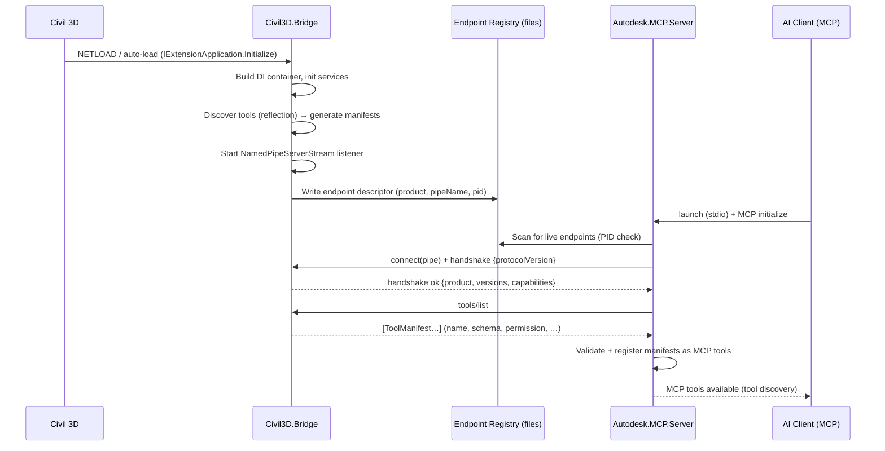
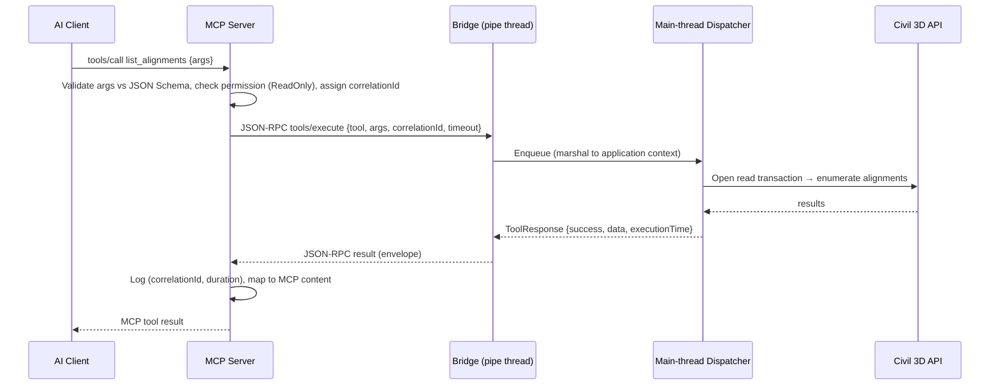
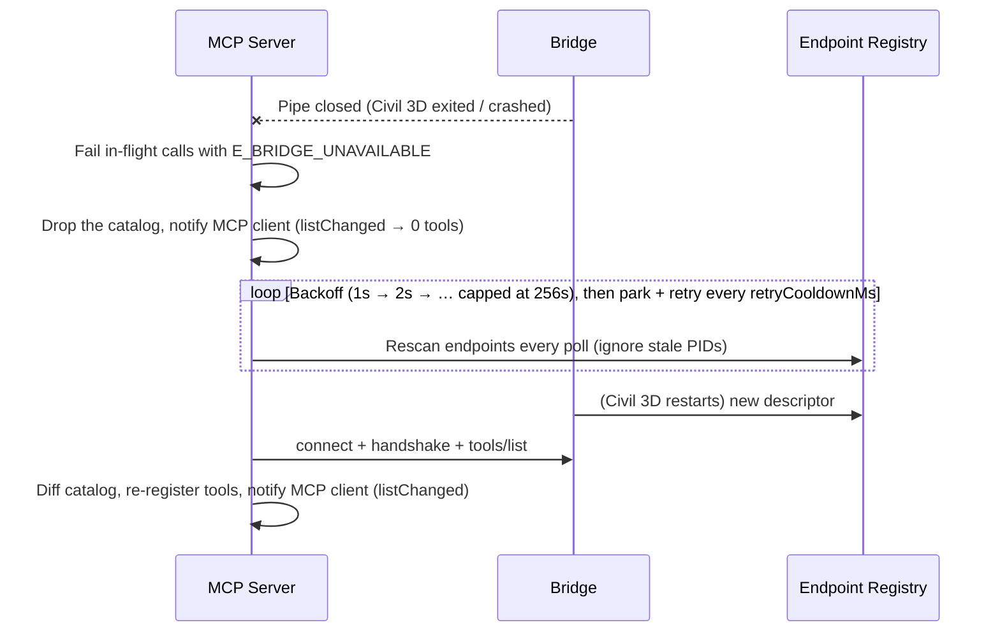
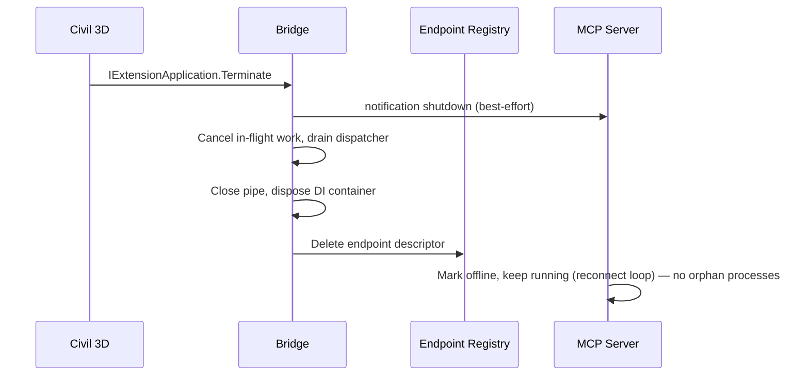

# Autodesk MCP Platform — Architecture

**Status:** Release Candidate 1 (`1.0.0-rc.1`)
**Date:** 2026-08-08 (Phase 8 update)
**Scope:** Overall architecture, solution structure, technology decisions, sequence diagrams, packaging and release engineering.

---

## 1. System Overview

The platform lets any MCP-compatible AI client (Claude, ChatGPT, Codex, Cursor, VS Code, Ollama, …)
drive Autodesk desktop applications through a strict three-layer separation:

```
┌────────────────────────────────────────────────────────────┐
│  AI Client (any MCP client — vendor-neutral)               │
└──────────────────────────┬─────────────────────────────────┘
                           │  Model Context Protocol (stdio)
┌──────────────────────────┴─────────────────────────────────┐
│  Autodesk.MCP.Server  (TypeScript / Node.js)               │
│  MCP protocol · tool registry · validation · routing       │
│  logging · sessions · permissions                          │
└──────────────────────────┬─────────────────────────────────┘
                           │  JSON-RPC 2.0 over Windows Named Pipes
┌──────────────────────────┴─────────────────────────────────┐
│  Civil3D.Bridge  (C# / .NET 8, loaded via NETLOAD)         │
│  Tool execution · transactions · main-thread dispatch      │
└──────────────────────────┬─────────────────────────────────┘
                           │  Autodesk .NET API (in-process)
┌──────────────────────────┴─────────────────────────────────┐
│  Autodesk Civil 3D 2025 / 2026                             │
└────────────────────────────────────────────────────────────┘
```

**Invariants (never violated):**

1. The Bridge has **no** MCP or AI knowledge. It is an execution engine that speaks a private
   JSON-RPC protocol over a local named pipe.
2. The MCP Server has **no** Autodesk API references. It discovers tools *dynamically* from
   whatever Bridge it connects to.
3. Adding a new Bridge (AutoCAD, Revit, Navisworks, Inventor, Plant 3D) requires **zero changes**
   to Autodesk.MCP.Server — the server learns the tool catalog at handshake time.
4. Nothing ever listens on a network port. Named pipes are local-machine, ACL'd to the current user.

---

## 2. Key Architectural Decisions

### AD-01 — Dynamic tool discovery via runtime manifests (the load-bearing decision)

Tools live in the Bridge (C#). Each tool class carries metadata (name, description, category,
version, permission level) and strongly-typed input/output DTOs. At startup the Bridge:

1. Reflection-scans its assemblies for tool classes (SDK base class + attribute).
2. Generates a **manifest** per tool, including JSON Schemas derived from the DTO types.
3. Serves the full catalog over the pipe via `tools/list`.

The MCP Server calls `tools/list` at handshake and registers every manifest as an MCP tool.
Consequences:

- Adding a tool = adding **one C# class**. No server change, no manual registration.
- The TypeScript server needs no compile-time knowledge of any Autodesk product.
- C# DTOs are the single source of truth for schemas (no dual maintenance of TS types).
- The server still validates every request against the received JSON Schema before routing.

### AD-02 — Transport: JSON-RPC 2.0 over Windows Named Pipes

- **Framing:** newline-delimited UTF-8 JSON (NDJSON). `JSON.stringify`/`System.Text.Json` never
  emit raw newlines, so framing is unambiguous, and the wire is trivially debuggable.
  (Length-prefixed framing was considered; NDJSON wins on simplicity and tooling.)
- **Roles:** the Bridge hosts `NamedPipeServerStream` (it lives as long as Civil 3D); the MCP
  Server is the pipe *client* with automatic reconnect + exponential backoff.
- **Protocol methods (bridge protocol, not MCP):**
  `handshake`, `tools/list`, `tools/execute`, `health/ping`, `shutdown`,
  notification `$/cancel` (cancellation), notification `$/progress` (long operations).
- **Correlation:** JSON-RPC `id` + a `correlationId` propagated end-to-end into logs.
- **Timeouts:** per-tool, declared in the manifest (default 30 s; corridor/surface rebuilds may
  declare more). Cancellation flows as `$/cancel` → `CancellationToken` in the Bridge.
- **Version negotiation:** `handshake` exchanges semver `protocolVersion`; the server refuses
  incompatible majors with a clear error.

### AD-03 — Bridge discovery: endpoint registry, not hardcoded pipe names

Each Bridge, on startup, writes an endpoint descriptor to
`%LOCALAPPDATA%\AutodeskMcp\endpoints\<product>-<pid>.json`:

```json
{
  "product": "Civil3D",
  "productVersion": "2026",
  "bridgeVersion": "1.0.0",
  "pipeName": "autodesk-mcp-civil3d-<pid>",
  "pid": 12345,
  "startedUtc": "2026-08-07T12:00:00Z"
}
```

The descriptor is deleted on clean shutdown; stale entries are detected by checking the PID.
The MCP Server scans this directory to find live Bridges. This gives us:

- Multi-instance support (two Civil 3D sessions) and multi-product support for free.
- Future Bridges plug in by writing a descriptor — the server code never changes.

### AD-04 — Main-thread dispatch + transactional execution in the Bridge

Autodesk APIs are single-threaded (application/document context). The pipe listener runs on
background threads; every tool execution is marshaled to the AutoCAD application context via
`Application.DocumentManager.ExecuteInApplicationContext`, with an async dispatcher queue in
between. Editing tools additionally take a `DocumentLock` and run inside a transaction:

open transaction → validate → execute → commit, with rollback + structured error on any failure.
Raw exceptions never cross the pipe — they are mapped to the standard response envelope with a
stable `errorCode`.

### AD-05 — Standard response envelope

Every tool returns exactly:

```json
{
  "success": true,
  "message": "",
  "executionTime": 0,
  "errorCode": "",
  "data": {}
}
```

`errorCode` values come from a shared, documented enum (e.g. `E_NO_ACTIVE_DOCUMENT`,
`E_OBJECT_NOT_FOUND`, `E_TRANSACTION_FAILED`, `E_TIMEOUT`, `E_CANCELLED`, `E_PERMISSION_DENIED`,
`E_VALIDATION_FAILED`, `E_BRIDGE_UNAVAILABLE`).

### AD-06 — Permissions and confirmation

Manifest field `permission`: `ReadOnly` | `ModifyDrawing` | `Export` | `Administrative`.
Enforcement lives in the **MCP Server** (policy) — the Bridge trusts nothing and re-checks the
declared permission against the operation type (defense in depth). Editing tools require
confirmation before execution: the server uses MCP **elicitation** when the client supports it,
and otherwise requires an explicit `confirm: true` argument (documented in each editing tool's
schema). Policy defaults are configurable (e.g. allow-list categories, read-only mode).

### AD-07 — Engineering workflow tools are Bridge-side orchestrations

High-level tools (`calculate_cut_fill`, `earthwork_report`, `quantity_takeoff`, …) are ordinary
tool classes in the Bridge that compose multiple Civil 3D API operations inside one dispatch /
transaction scope. They are *not* server-side compositions — keeping orchestration next to the
API avoids chatty pipe round-trips and keeps transactional integrity.

---

## 3. Technology Decisions

| Concern | Choice | Rationale |
|---|---|---|
| MCP Server language | TypeScript 5.x on Node.js ≥ 20 LTS | Official MCP SDK, first-class stdio transport, broad client compatibility |
| MCP SDK | `@modelcontextprotocol/sdk` | Reference implementation; stdio now, Streamable HTTP later without redesign |
| Server validation | Zod (+ received JSON Schemas via ajv) | Static config typed with Zod; dynamic tool inputs validated with ajv against Bridge-supplied schemas |
| Server logging | pino (structured JSON, file + stderr) | Structured, fast, redactable; stdout is reserved for MCP stdio |
| Server tests | Vitest | Fast, TS-native |
| Bridge target | `net8.0-windows` | Civil 3D 2025/2026 run on .NET 8 (AutoCAD 2025+ moved off .NET Framework) |
| Autodesk refs | `acdbmgd`, `acmgd`, `accoremgd`, `AeccDbMgd` (2025 SDK, `Copy Local = false`) | Compile against 2025, run on 2025/2026 via binding-compatible APIs |
| C# JSON | `System.Text.Json` | Built-in, fast, source-gen friendly; camelCase policy matching the wire format |
| Schema generation | NJsonSchema (MIT) | Generates JSON Schema from DTO types at startup for manifests |
| Bridge DI | `Microsoft.Extensions.DependencyInjection` | Standard, testable, no static service locators |
| Bridge logging | `Microsoft.Extensions.Logging` + Serilog file sink | Structured logs with correlation/session IDs; rolling files under `%LOCALAPPDATA%\AutodeskMcp\logs` |
| C# tests | xUnit + NSubstitute | Autodesk-free layers (SDK, Shared, protocol) fully unit-testable; Autodesk APIs isolated behind interfaces |
| Packaging | Autodesk bundle (`PackageContents.xml`) + npm package / `npx` for the server | Standard Autodesk auto-load mechanism; standard MCP client configuration |

**Shared contracts strategy:** the `Shared` C# project (envelopes, error codes, enums,
protocol DTOs) is referenced by SDK and Bridge. The TypeScript server mirrors only the small,
stable **protocol** layer (envelope, handshake, error codes) — hand-written once, protected by
round-trip serialization tests on both sides. All *tool* schemas flow dynamically (AD-01), so
there is no per-tool duplication anywhere.

---

## 4. Solution Structure

```
autodesk-mcp-platform/
├── AutodeskMcp.sln
├── README.md
├── docs/
│   ├── ARCHITECTURE.md              (this document)
│   ├── INSTALLATION.md
│   ├── DEVELOPER-GUIDE.md
│   ├── BRIDGE-DEVELOPMENT.md
│   ├── ADDING-TOOLS.md
│   ├── PROTOCOL.md                  (pipe protocol specification)
│   └── SCHEMAS.md
├── schemas/                         (protocol-level JSON Schemas, versioned)
├── src/
│   ├── server/                      ── Autodesk.MCP.Server (TypeScript)
│   │   ├── package.json
│   │   ├── tsconfig.json
│   │   └── src/
│   │       ├── index.ts             (bootstrap: config → bridge discovery → MCP server)
│   │       ├── config/              (typed configuration, Zod)
│   │       ├── protocol/            (envelope, JSON-RPC types, error codes — mirrors Shared)
│   │       ├── bridge/              (endpoint registry scan, pipe client, framing,
│   │       │                         reconnect, request correlation, cancellation)
│   │       ├── mcp/                 (MCP server wiring, dynamic tool registration)
│   │       ├── registry/            (tool catalog, manifest cache, refresh)
│   │       ├── policy/              (permission levels, confirmation, allow-lists)
│   │       ├── session/             (session IDs, per-session state)
│   │       └── logging/             (pino setup, correlation propagation)
│   ├── shared/
│   │   └── Autodesk.Mcp.Shared/     ── Shared (C#, netstandard-free net8.0)
│   │       ├── Protocol/            (JSON-RPC message models, handshake DTOs)
│   │       ├── Envelopes/           (ToolResponse, ToolRequest)
│   │       ├── Manifests/           (ToolManifest model)
│   │       ├── Enums/               (PermissionLevel, ToolCategory, …)
│   │       └── Errors/              (ErrorCodes, BridgeException hierarchy)
│   ├── sdk/
│   │   └── Autodesk.Mcp.Sdk/        ── SDK (C#, product-agnostic, no Autodesk refs)
│   │       ├── Communication/       (NamedPipeHost, NDJSON framing, connection lifecycle)
│   │       ├── Dispatch/            (JSON-RPC router, cancellation registry)
│   │       ├── Tools/               (ITool, ToolBase<TIn,TOut>, McpToolAttribute)
│   │       ├── Discovery/           (reflection scanner, manifest generator ← NJsonSchema)
│   │       ├── Registration/        (endpoint registry writer)
│   │       └── Hosting/             (BridgeHost: DI container, startup/shutdown orchestration)
│   └── bridges/
│       └── Civil3D.Bridge/          ── Civil3D.Bridge (C#, net8.0-windows)
│           ├── Plugin/              (IExtensionApplication: NETLOAD entry, lifecycle)
│           ├── Execution/           (main-thread dispatcher, TransactionRunner, DocumentLock scope)
│           ├── Services/            (ICivilDocumentService, IEntityLookup, … thin API wrappers)
│           └── Tools/
│               ├── Drawing/  Layers/  Alignments/  Profiles/  Surfaces/
│               ├── Corridors/  PipeNetworks/  PressureNetworks/  Cogo/
│               ├── Parcels/  Styles/  Objects/  Export/
│               └── Engineering/     (cut/fill, cross-sections, QTO, validation, …)
├── tests/
│   ├── Autodesk.Mcp.Shared.Tests/   (serialization round-trips, error codes)
│   ├── Autodesk.Mcp.Sdk.Tests/      (framing, routing, discovery, manifests, pipe integration)
│   ├── Civil3D.Bridge.Tests/        (tool logic against mocked services)
│   └── server/                      (Vitest: validation, registry, routing, reconnect — in src/server)
└── tools/
    ├── scripts/                     (build.ps1, netload helper, dev loop)
    └── packaging/                   (PackageContents.xml, bundle layout)
```

Dependency direction (enforced): `Civil3D.Bridge → SDK → Shared`. The SDK never references
Autodesk assemblies, so **all** communication/discovery/manifest logic is unit-testable without
Civil 3D, and future bridges (AutoCAD, Revit, …) reuse it wholesale.

---

## 5. Sequence Diagrams

### 5.1 Startup & handshake



### 5.2 Read-only tool call (`list_alignments`)



### 5.3 Editing tool call with confirmation (`create_alignment`)

```mermaid
sequenceDiagram
    participant AI as AI Client
    participant S as MCP Server
    participant B as Bridge
    participant D as Dispatcher
    participant API as Civil 3D API

    AI->>S: tools/call create_alignment {args}
    S->>S: Validate schema; permission = ModifyDrawing
    alt Client supports elicitation
        S-->>AI: Elicit confirmation (summary of pending change)
        AI-->>S: confirmed
    else No elicitation support
        S->>S: Require args.confirm == true, else E_CONFIRMATION_REQUIRED
    end
    S->>B: tools/execute {…}
    B->>D: Enqueue on main thread
    D->>API: DocumentLock → Transaction.Start
    D->>API: Validate inputs → create alignment
    alt Success
        D->>API: Commit
        D-->>B: {success:true, data:{objectId, name}}
    else Failure
        D->>API: Abort (rollback)
        D-->>B: {success:false, errorCode, message}
    end
    B-->>S: envelope
    S-->>AI: MCP result (never a raw exception)
```

### 5.4 Bridge restart / reconnect



The rescan runs on **every** poll, not only when the registry changes, so a connection that
failed against an unchanged descriptor is retried rather than stranded. Exhausting the
attempt budget parks the endpoint for `retryCooldownMs`; it is never a terminal state while
the server process lives.

### 5.5 Shutdown



---

## 6. Cross-Cutting Concerns

- **Logging:** every log entry carries `timestamp`, `sessionId`, `correlationId`, `tool`,
  `durationMs`, sanitized parameters, result summary, and full exception + stack trace on
  failure (Bridge side only — stack traces never cross the pipe). Server: pino JSON files;
  Bridge: Serilog rolling files. Both under `%LOCALAPPDATA%\AutodeskMcp\logs\`.
- **Security:** pipe ACL = current user only; no network listeners; parameters logged with
  redaction hooks; future auth (token in handshake) has a reserved field from day one.
- **Testability:** everything below MCP and above the Autodesk API is pure and DI-driven.
  Named-pipe integration tests run the real SDK host + a real Node client in-process.
- **Versioning:** protocol semver in handshake; tool semver in manifests; envelope is frozen.

---

## 7. Phase Plan

1. **Phase 1** — Architecture. ✅
2. **Phase 2** — Shared: contracts, DTOs, error codes, serialization tests. ✅
3. **Phase 3** — SDK + Civil3D.Bridge skeleton: lifecycle, pipe host, dispatcher. ✅
4. **Phase 4** — Autodesk.MCP.Server: pipe client, registry, manifest loader, MCP wiring. ✅
5. **Phase 5** — Read-only tools (drawing, layers, listings, reports). ✅
6. **Phase 6** — Editing tools (transactions, confirmation flow). ✅
7. **Phase 7** — Engineering workflow tools. ✅
8. **Phase 8** — Packaging, release engineering, CI/CD, benchmarks, E2E. ⟵ **current (RC1)**

---

## 8. Packaging & Release Engineering (Phase 8)

### 8.1 Deliverables layout

```
autodesk-mcp-platform/
├── .github/workflows/         CI (quality gates) + release pipeline
├── packaging/Civil3D.Bridge.Bundle/PackageContents.xml
├── eng/
│   ├── version.json           single source of truth (SemVer)
│   └── scripts/               sync-version, release-notes, build-bridge-bundle, quality-gate
├── benchmarks/                .NET benchmark harness + Node (vitest bench) suite
├── e2e/                       real-process end-to-end MCP tests
├── examples/                  client configs, prompts, workflows, JSON-RPC samples
├── docs/                      installation, configuration, troubleshooting, release process, …
└── artifacts/                 (gitignored) packages, bundles, release notes
```

### 8.2 Versioning

- `eng/version.json` holds the single SemVer (currently `1.0.0-rc.1`).
- `eng/scripts/sync-version.mjs` propagates it to `Directory.Build.props` (all C#
  assemblies), the npm `package.json`, the bundle `PackageContents.xml` and the
  sample/shipped configuration files.
- Git release tags use `v<semver>` (e.g. `v1.0.0-rc.1`). Releases are cut from tags
  by `release.yml`; see `docs/ReleaseProcess.md`.

### 8.3 Bridge packaging (Autodesk Application Bundle)

- `eng/scripts/build-bridge-bundle.mjs` publishes `Civil3D.Bridge` in Release and
  assembles an autoload bundle (`PackageContents.xml` + `Contents/`) plus a zip.
- Per-user install: copy the bundle folder into
  `%APPDATA%\Autodesk\ApplicationPlugins\` (or `--install` flag). The Autodesk
  plugin loader then NETLOADs the bridge automatically on Civil 3D startup.
- `PackageContents.xml` `AppVersion` is version-synced; `RuntimeRequirements`
  targets AutoCAD R24.3–R25.0 (Civil 3D 2025/2026).

### 8.4 Server packaging (npm)

- `autodesk-mcp-server` is published from `src/server/Autodesk.Mcp.Server`;
  `prepack` runs typecheck + build, `files` ships only `dist/` + `README.md`.
- The CLI (`dist/index.js`, shebang included) supports `-c/--config`,
  `-V/--version`, `-h/--help`; version is read from `package.json` at runtime.

### 8.5 Quality gates

Every CI run verifies: restore, build (warnings-as-errors for .NET; strict
TypeScript + ESLint for the server), all unit/integration tests, formatting
(`dotnet format --verify-no-changes`), packaging (`npm pack`, bundle assembly),
benchmarks on demand and the real-process E2E suite. See `docs/DeveloperGuide.md`.

### 8.6 Autodesk SDK coupling in CI

Only `Civil3D.Bridge` and `Civil3D.Tools.Drawing` reference Autodesk assemblies,
so cloud CI builds/tests everything else; the bridge build + bundle assembly runs
on a self-hosted Windows runner labeled `civil3d` (or locally). See
`docs/DeveloperGuide.md` and `.github/workflows/ci.yml`.
